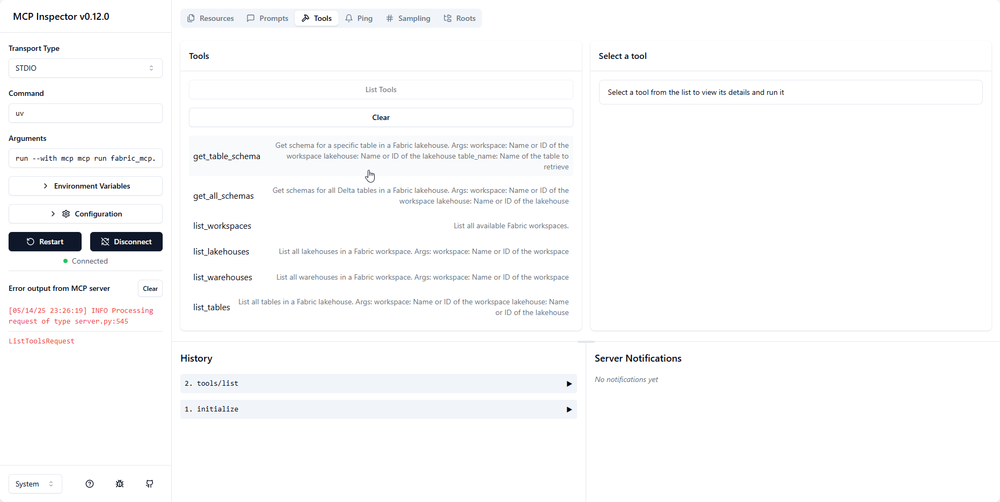
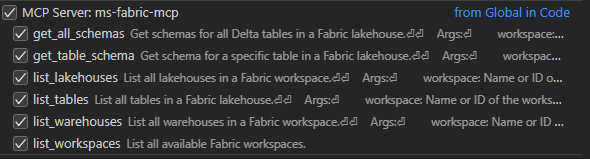

# Fabric MCP

Fabric MCP is a Python-based MCP server for interacting with Microsoft Fabric APIs. It provides utilities for managing workspaces, lakehouses, warehouses, and tables.(More incoming features will be added in the future).
This project is inspired by the following project: https://github.com/Augustab/microsoft_fabric_mcp/tree/main
## Features

- List workspaces, lakehouses, warehouses, and tables.
- Retrieve schemas and metadata for Delta tables.
- Generate markdown documentation for Delta tables.

## Requirements

- Python 3.12 or higher
- Azure credentials for authentication
- uv (from astral) : [Installation instructions](https://docs.astral.sh/uv/getting-started/installation/#installing-uv)
- Azure Cli : [Installation instructions](https://learn.microsoft.com/en-us/cli/azure/install-azure-cli?view=azure-cli-latest)
- Optional: Node.js and npm for running the MCP inspector : [Installation instructions](https://nodejs.org/en/download)

## Installation

1. Clone the repository:
   ```bash
   git clone https://github.com/your-repo/fabric-mcp.git
   cd fabric-mcp
   ```

2. Set up your virtual environment and install dependencies:
   ```bash
   uv sync
   ```

3. Install dependencies:
   ```bash
   pip install -r requirements.txt
   ```

## Usage

### Connect to MS Fabric

- Run the Azure CLI command to log in:
    ```bash
    az login --scope https://api.fabric.microsoft.com/.default
    ```
### Running the MCP Server and coonecting to it using the MCP inspector

- Run the MCP server with the inspector exposed for testing:
        ```bash
        uv run --with mcp mcp dev fabric_mcp.py
        ```
        This will start the server and expose the inspector at `http://localhost:6274`.
        

### Running the MCP Server and coonecting to it using the MCP inspector
- To use the MCP server with VSCode, you can set up a launch configuration in your `launch.json` file:
    ```json
    {
        //Existing configurations...
        "mcp": {
        "servers": {
            "ms-fabric-mcp": {
                "type": "stdio",
                "command": "<FullPathToProjectFolder>\\.venv\\Scripts\\python.exe ",
                "args": [
                    "<FullPathToProjectFolder>\\fabric_mcp.py"
                ]
            }
        }
    }
    }
    ```
    This configuration allows you to run and connect to the MCP server directly from VSCode.
    And provide access to the Tools : 
    
- Using Agent mode in the Copilot chat, you can access the different tools available in the MCP server by specifying to tool name with #<tool>, for example #list_workspaces. 

### Available Tools

The following tools are available via the MCP server:

- **`list_workspaces`**: List all available Fabric workspaces.
- **`list_lakehouses(workspace)`**: List all lakehouses in a specified workspace.
- **`list_warehouses(workspace)`**: List all warehouses in a specified workspace.
- **`list_tables(workspace, lakehouse)`**: List all tables in a specified lakehouse.
- **`get_lakehouse_table_schema(workspace, lakehouse, table_name)`**: Retrieve the schema and metadata for a specific Delta table.
- **`get_all_lakehouse_schemas(workspace, lakehouse)`**: Retrieve schemas and metadata for all Delta tables in a lakehouse.
- **`set_lakehouse(workspace, lakehouse)`**: Set the current lakehouse context.
- **`set_warehouse(workspace, warehouse)`**: Set the current warehouse context.
- **`set_workspace(workspace)`**: Set the current workspace context.


## License

This project is licensed under the MIT License. See the LICENSE file for details.
